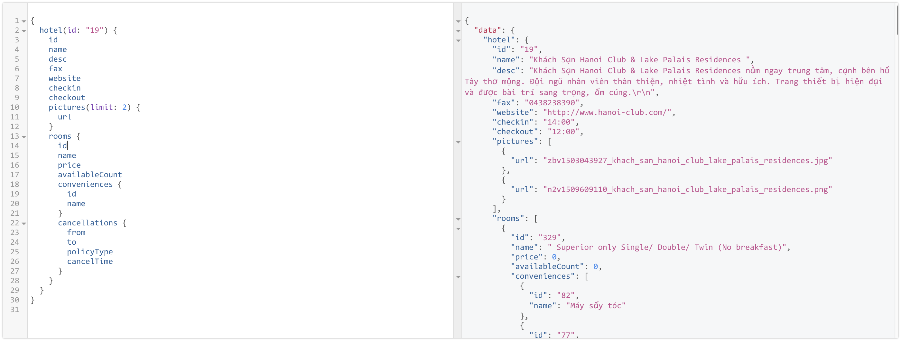

# contents api

> hotel details api using graphql & redis



# Usage

Example query

```
query {
  {
    hotel (id: "24") {
      id
      name
      lat
      lng
      pmsUrl
      buildTime
      repairTime
      bankName
      bankAccountNumber
      bankHolder
      contractStart
      contractFinish
      contractType
      contractCode
      pictures(limit: 5) {id, url }
      ranking { id, avg }
      nearbyLocations(limit: 5) { id, name, districtId, cityId, pictureUrl, lat, lng }
    }
  }
}
```

# Benchmark

See [benchmark](./benchmark).

# Development

Fill in require environment according to `.env.example`, save it as `.env`

```
MYSQL_CONNECTION_URL=
REDIS_HOST=
REDIS_PORT=
REDIS_DB=
REDIS_PREFIX=
DEFAULT_CACHE_DURATION=
APP_SECRET=
```

And then

```sh
npm i
# start redis + redisearch plugin (docker required)
npm run redis
npm run dev
```

# Usage

Navigate to `http://localhost:3000/graphiql` to give a try. Please note that `/graphiql` is only avaiable during development mode (`NODE_ENV=development`). Make sure to set this in your local `.env`


